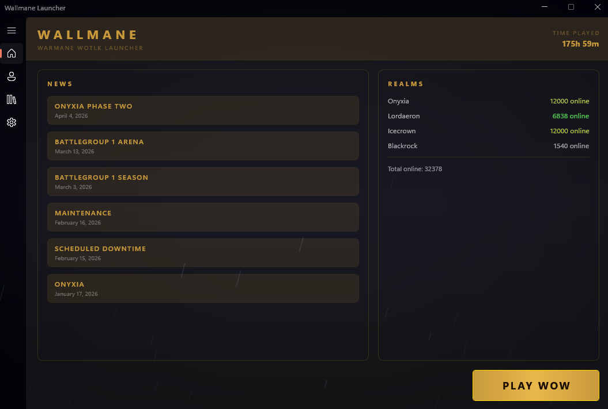
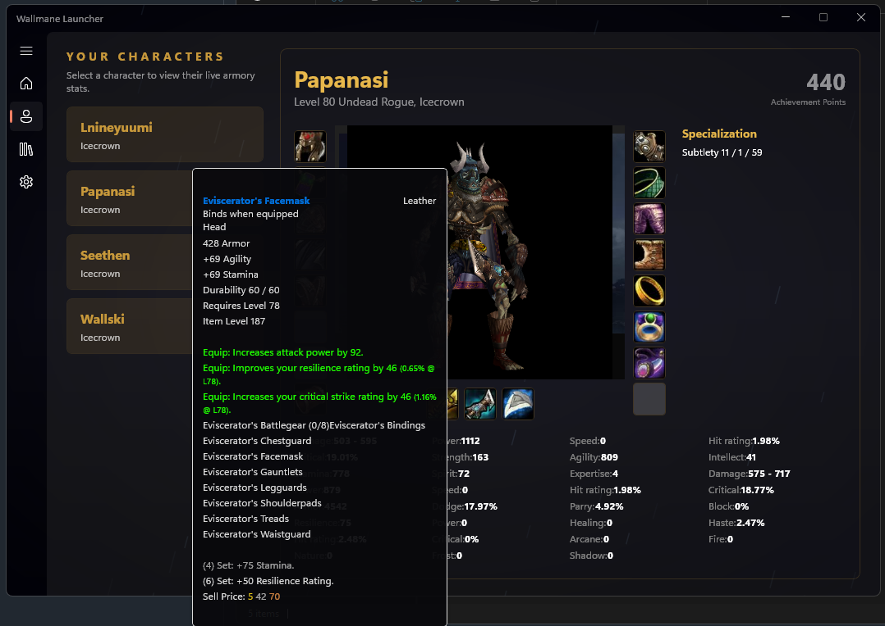
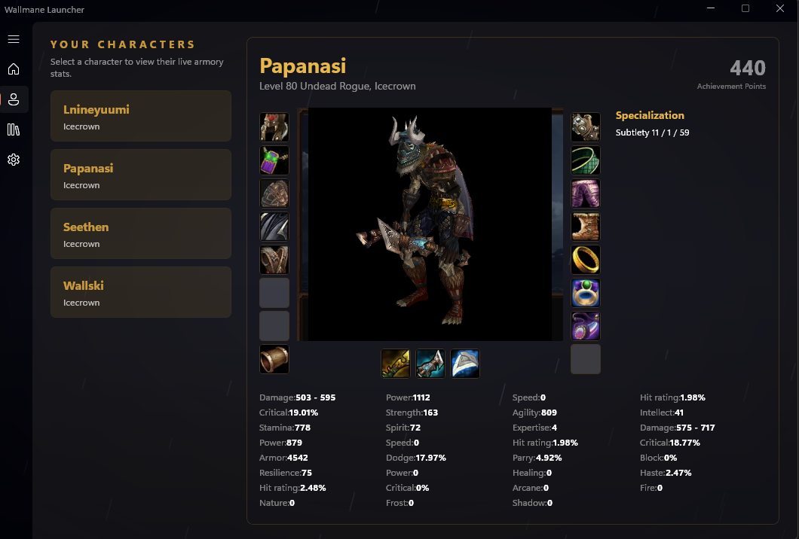
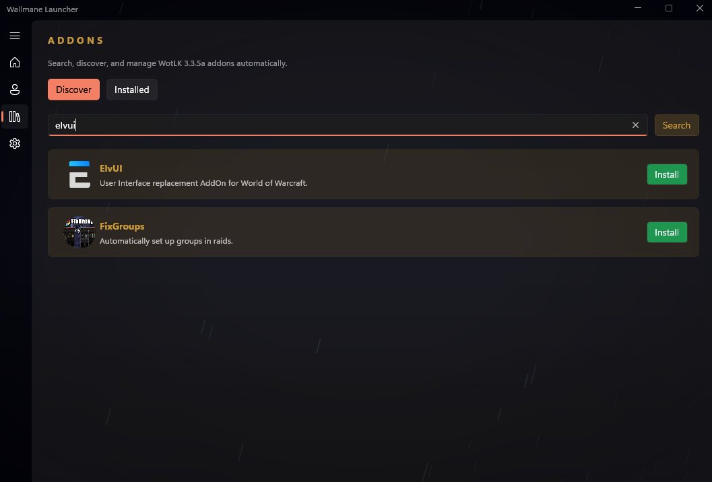
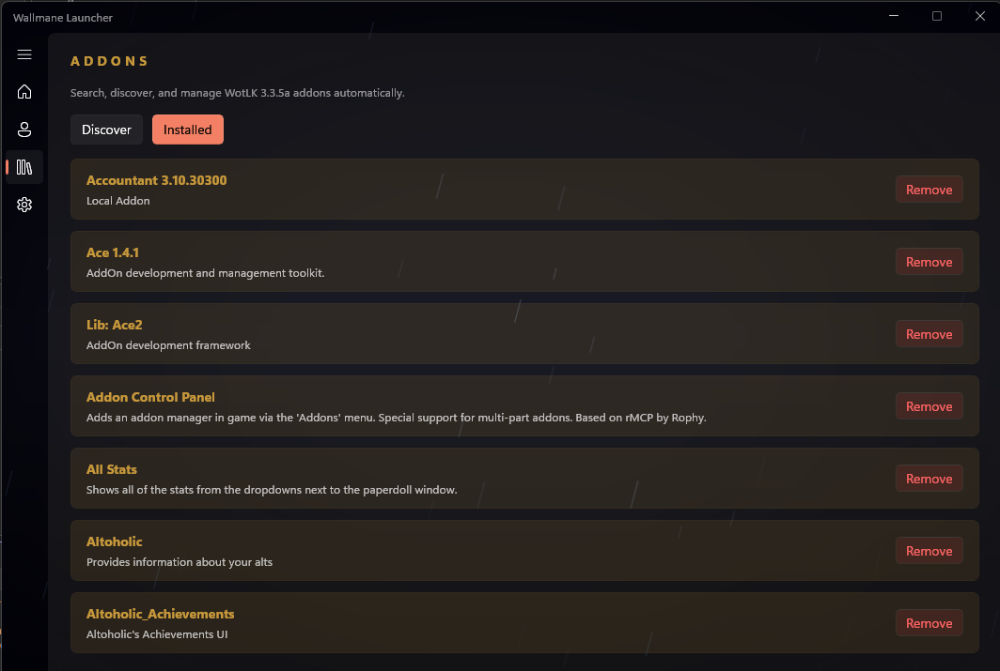
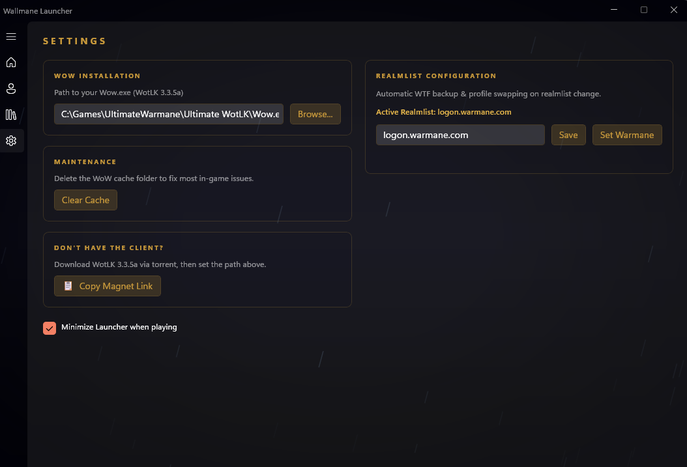

# Wallmane

Wallmane is a modern, high-performance desktop launcher for Warmane's World of Warcraft: Wrath of the Lich King (3.3.5a) server. Built natively with WinUI 3 and C++/WinRT, it offers a fast, low-footprint experience with real-time server statistics, character armory inspection, automated addon management, and custom client configuration.

---

## Overview

<p align="center">
  
</p>

Wallmane streamlines launcher operations while integrating deep live data from Warmane. It combines custom native rendering with web scraping and API integrations to bring server news, realm populations, live character armory view, and addon management into a single unified workspace.

---

## Feature Showcase

### Live Armory & Interactive 3D Inspection

<p align="center">
  
  
</p>

- Inspect all characters associated with your account accounts and WTF data.
- Real-time 3D character model viewer with interactive controls.
- Full gear slot overview with rich, colored in-game style item tooltips fetched live from database sources.
- Complete breakdown of combat stats, attributes, ratings, and active specialization talent trees.

---

### Addon Management & Discovery

<p align="center">
  
  
</p>

- **Discover**: Search and install popular WotLK 3.3.5a addons with one click directly from verified archives.
- **Installed**: Automatically scans your `Interface/AddOns` folder to detect, list, and remove installed addons.
- Background downloading and automated extraction into the correct directories.

---

### Configuration & Realmlist Swapping

<p align="center">
  
</p>

- **Game Path Detector**: Remembers and validates your `Wow.exe` directory.
- **Realmlist Manager**: Switch realmlists instantly with automatic WTF backup and profile preservation.
- **Playtime Tracker**: Automatically calculates total time played across all characters using local WTF save logs (`DataStore_Characters`).
- **Maintenance Utility**: One-click WoW cache clearer to resolve common client display and data sync bugs.
- **Client Acquisition**: Built-in magnet link generator for downloading the WotLK 3.3.5a client.

---

## Core Features

- **Native Windows Desktop UI**: Built with WinUI 3, Windows App SDK, and C++/WinRT for zero-lag rendering and low memory footprint.
- **Atmospheric Design**: Modern dark theme with custom GPU-accelerated DirectComposition rain and lightning visual effects.
- **Real-Time Realm Status**: Live online player counts for Onyxia, Lordaeron, Icecrown, and Blackrock.
- **Warmane News Feed**: Latest server updates and maintenance alerts directly on the dashboard.
- **Discord Rich Presence**: Custom status integration displaying current game state and realm activity.
- **Tray & Launch Options**: Configurable auto-minimize behavior upon launching the game client.

---

## Requirements

- **Operating System**: Windows 10 (Build 17763) or Windows 11
- **Runtime**: Windows App Runtime 1.4+ / 2.0
- **Client**: World of Warcraft 3.3.5a (WotLK) executable

---

## Building from Source

### Prerequisites

1. Visual Studio 2022 (v17.0 or higher)
2. Workloads:
   - Desktop development with C++
   - Universal Windows Platform development / WinUI 3 templates
3. C++/WinRT Extension for Visual Studio

### Build Instructions

1. Clone the repository:
   ```bash
   git clone https://github.com/wallski/wallmane.git
   ```
2. Open `wallmane.slnx` (or `wallmane.sln`) in Visual Studio 2022.
3. Select `Debug` or `Release` configuration and `x64` platform.
4. Build and run the solution (`F5`). NuGet dependencies will be automatically restored on first compile.

---

## Technical Notes

- **Addon Extraction**: Built using Windows native `tar.exe` for zero external dependencies.
- **Security & Privacy**: No login credentials or account passwords are required or stored.
- **PCH Compilation**: Large WinRT header dependencies utilize precompiled headers with `/Zm500` heap allocation options.

---

## License

This project is released under the MIT License.
